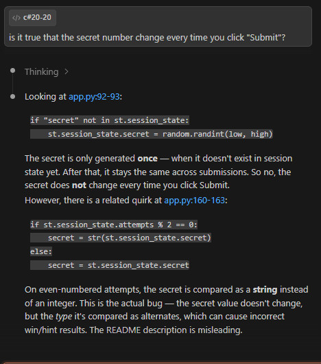
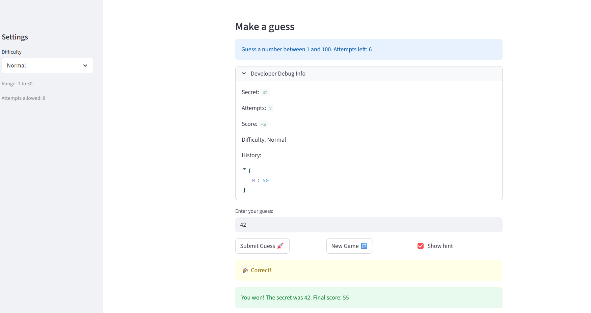
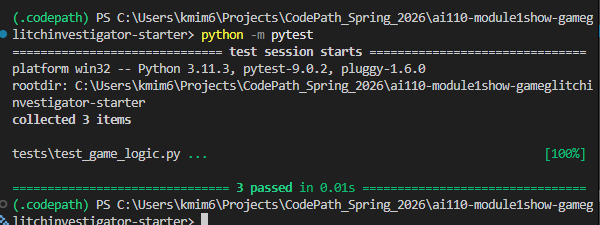

# 🎮 Game Glitch Investigator: The Impossible Guesser

## 🚨 The Situation

You asked an AI to build a simple "Number Guessing Game" using Streamlit.
It wrote the code, ran away, and now the game is unplayable. 

- You can't win.
- The hints lie to you.
- The secret number seems to have commitment issues.

## 🛠️ Setup

1. Install dependencies: `pip install -r requirements.txt`
2. Run the broken app: `python -m streamlit run app.py`

## 🕵️‍♂️ Your Mission

1. **Play the game.** Open the "Developer Debug Info" tab in the app to see the secret number. Try to win.
2. **Find the State Bug.** Why does the secret number change every time you click "Submit"? Ask ChatGPT: *"How do I keep a variable from resetting in Streamlit when I click a button?"* 
   - I made a fresh fork and I didn't find this to be an issue anymore. The secret stays the same. It is possible the code has been updated. I asked Claude and it said the same thing. 
   
3. **Fix the Logic.** The hints ("Higher/Lower") are wrong. Fix them.
4. **Refactor & Test.** - Move the logic into `logic_utils.py`.
   - Run `pytest` in your terminal.
   - Keep fixing until all tests pass!

## 📝 Document Your Experience

- [ ] Describe the game's purpose. 
      - The game is to guess a secret number within a range given by the difficulty level. 
- [ ] Detail which bugs you found.
1. The hints were backwards. Entering less than secret would give hint go lower and entering higher than would hint go higher. Also, I want to see the message enter a number from 1 to 100 when a number enter out of bound (1-100).

2. New Game doesn't reset the score. The score looks a bit weird; guessing correct results lower/negative score. Choosing a harder difficulty gives lower score than normal. 

3. Also, the range for normal and hard level feels off. Hard should be bigger range than normal, so requires more guesses. 

4. Changing diffculty level doesn't generate a new scrent key, which it should as the range changes. We could do that by starting new game when diffuclty level is changed. 

- [ ] Explain what fixes you applied.
1. The hints were backwards. Entering less than secret would give hint go lower and entering higher than would hint go higher. Also, I want to see the message enter a number from 1 to 100 when a number enter out of bound (1-100).
   - The hint was backward and Claude helped fixed it to give the right hint.

2. Also, the range for normal and hard level feels off. Hard should be bigger range than normal, so requires more guesses. 
   - I updated the "Normal" range to be 1-50 and "Hard" to be 1-100.

3. New Game doesn't reset the score. The score looks a bit weird; guessing correct results lower/negative score. Choosing a harder difficulty gives lower score than normal. 
   - I reset the score to deafult (0) when a new game is started with the help of Claude. The code was adding +5 on high guesses on even attempts and subtracting 5 on odd attempts which is illogical. Wrong guess should take away points. I will deduct 5 points for either lower or higher guess. 

4. Changing diffculty level doesn't generate a new secret, which it should as the range changes, but it shows the difficulty level to be the new level. We could do that by starting new game when diffuclty level is changed.
   - Now, changing the difficulty level generates a new secret key in the new range. Claude helped with that even though it made a logical error with setting attempts to 1 instead of 0. 

## 📸 Demo

- [ ] [Insert a screenshot of your fixed, winning game here]
   - 
- Screenshot of test passing

## 🚀 Stretch Features

- [ ] [If you choose to complete Challenge 4, insert a screenshot of your Enhanced Game UI here]
