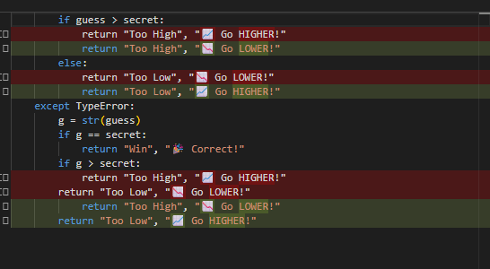
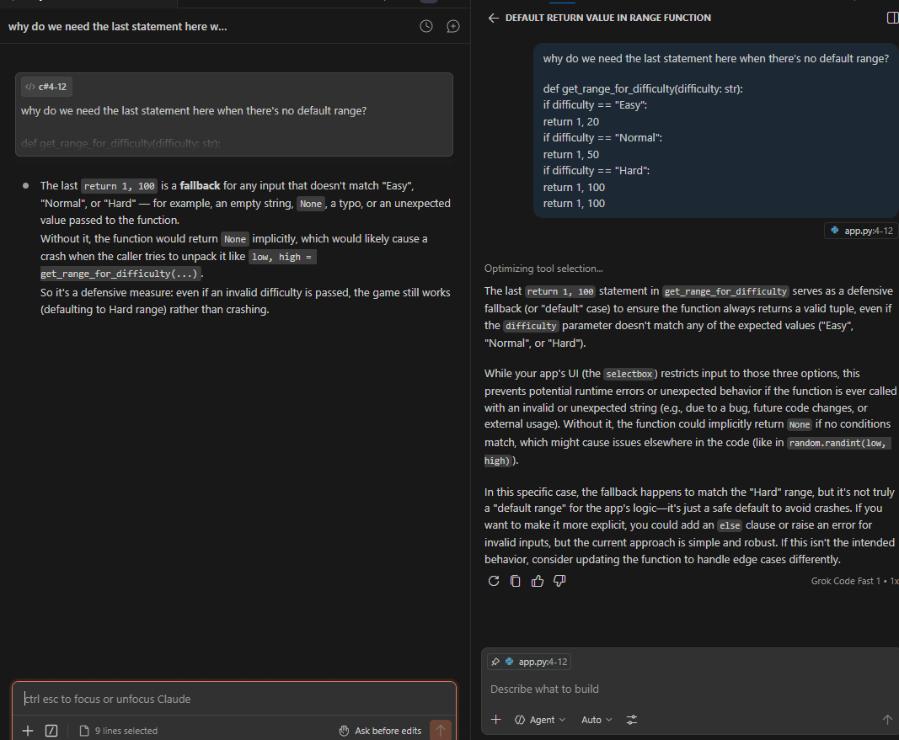

# 💭 Reflection: Game Glitch Investigator

Answer each question in 3 to 5 sentences. Be specific and honest about what actually happened while you worked. This is about your process, not trying to sound perfect.

## 1. What was broken when you started?

- What did the game look like the first time you ran it?
    - The game wasn't working correctly. The hint was wrong and entering a lower than hint would give the hint to go higher and choosing a number higher than secret would say to go higher. 

- List at least two concrete bugs you noticed at the start  
  (for example: "the hints were backwards").

1. The hints were backwards. Entering less than secret would give hint go lower and entering higher than would hint go higher. Also, I want to see the message enter a number from 1 to 100 when a number enter out of bound (1-100).

2. New Game doesn't reset the score. The score looks a bit weird; guessing correct results lower/negative score. Choosing a harder difficulty gives lower score than normal. 

3. Also, the range for normal and hard level feels off. Hard should be bigger range than normal, so requires more guesses. 

4. Changing diffculty level doesn't generate a new scrent key, which it should as the range changes. We could do that by starting new game when diffuclty level is changed. 

---

## 2. How did you use AI as a teammate?

- Which AI tools did you use on this project (for example: ChatGPT, Gemini, Copilot)?
  - We used Claude

- Give one example of an AI suggestion that was correct (including what the AI suggested and how you verified the result).
  - The AI was able to analyze why the hint was wrong and fix it 
    

- Give one example of an AI suggestion that was incorrect or misleading (including what the AI suggested and how you verified the result).
  - This isn't really a wrong suggestion, but it didn't recognize a more efficient fix with one "if" statement and "or" condition. 

---

## 3. Debugging and testing your fixes

- How did you decide whether a bug was really fixed?
- Describe at least one test you ran (manual or using pytest)  
  and what it showed you about your code.
- Did AI help you design or understand any tests? How?

---

## 4. What did you learn about Streamlit and state?

- How would you explain Streamlit "reruns" and session state to a friend who has never used Streamlit?

---

## 5. Looking ahead: your developer habits

- What is one habit or strategy from this project that you want to reuse in future labs or projects?
  - This could be a testing habit, a prompting strategy, or a way you used Git.
- What is one thing you would do differently next time you work with AI on a coding task?
- In one or two sentences, describe how this project changed the way you think about AI generated code.

- I used two AI Pair Programming tools (Claude and GitHub Copilot). Both gave good explanation, but Claude was more concise. 

